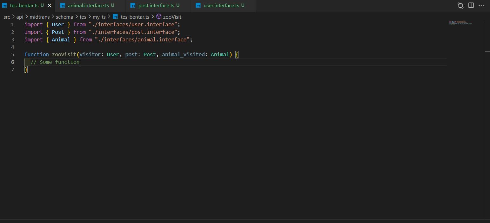

# Modul 2 - Java Script & TypeScript

## 1. JavaScript Basics

JavaScript adalah bahasa pemrograman yang digunakan untuk menambahkan interaksi dan logika ke halaman web.
Dalam modul ini, kalian akan mempelajari dasar-dasar JavaScript.

### 1.1. Menambahkan JavaScript ke HTML

1. **Inline JavaScript**: Menggunakan atribut seperti `onclick`.

   ```html
   <button onclick="alert('Hello World!')">Click Me</button>
   ```

2. **Internal JavaScript**: Menambahkan di dalam tag `<script>`.

   ```html
   <script>
   	function greet() {
   		alert("Hello, World!");
   	}
   </script>
   ```

3. **External JavaScript**: Menghubungkan file eksternal.

   ```html
   <script src="./script.js"></script>
   ```

### 1.2. Sintaks Dasar

- **Variabel**: Menggunakan `let`, dan `const`. (kenapa nggada `var` mas?, karena rekom masa sekarang better `let` dan `const` yeah)

  ```javascript
  let name = "Alice"; // variabel yang dapat diubah
  const age = 25; // variabel konstan
  ```

**Permaslaahan Dengan `Var`**

variabel yang dideklarasikan menggunakan `var` akan memiliki scope yang disebut sebagai _function scope_. Dalam javascript, hal ini berarti variabel tersbeut masih bisa diakses di luar blok (`for`, `if`) yang menyebabkan bug lebih susah dilacak.

Contoh:
```js
if (true) {
  var name = "Kelinci";
}
console.log(name); // "Kelinci" -> masih bisa diakses

if (true) {
  let newName = "Alice";
}
console.log(newName); // ❌ Error: name is not defined
```

- **Tipe Data**:

  - String
  - Number
  - Boolean
  - Null
  - Undefined
  - Object
  - Array

  ```javascript
  let str = "Hello";
  let num = 10;
  let isTrue = true;
  let nothing = null;
  ```

### 1.3. Fungsi

- **Mendefinisikan Fungsi**:

  ```javascript
  function greet(name) {
  	return `Hello, ${name}!`;
  }
  ```

- **Fungsi Ekspresi**:

  ```javascript
  const greet = function (name) {
  	return `Hello, ${name}!`;
  };
  ```

- **Fungsi Panah**:

  ```javascript
  const greet = (name) => `Hello, ${name}!`;
  ```

### 1.4. Pengkondisian

- **If-Else**:

  ```javascript
  let score = 85;

  if (score > 90) {
  	console.log("Excellent");
  } else if (score > 70) {
  	console.log("Good");
  } else {
  	console.log("Needs Improvement");
  }
  ```

### 1.5. Looping

- **For Loop**:

  ```javascript
  for (let i = 0; i < 5; i++) {
  	console.log(i);
  }
  ```

- **While Loop**:

  ```javascript
  let count = 0;
  while (count < 5) {
  	console.log(count);
  	count++;
  }
  ```

### 1.6. Menggunakan Local Storage

**Local Storage** adalah penyimpanan di browser yang memungkinkan kalian menyimpan data secara permanen di sisi klien (hingga dihapus secara manual oleh pengguna).

#### 1.6.1. Menyimpan Data ke Local Storage

Untuk menyimpan data ke local storage, gunakan metode `localStorage.setItem()`. Metode ini menerima dua parameter: kunci (key) dan nilai (value).

Contoh menyimpan data:

```javascript
localStorage.setItem("username", "Alice");

const user = {
	name: "Alice",
	age: 25,
};
localStorage.setItem("user", JSON.stringify(user));
```

#### 1.6.2. Mengambil Data dari Local Storage

Untuk mengambil data yang telah disimpan di local storage, gunakan metode `localStorage.getItem()`. Jika datanya adalah string yang di-encode sebagai JSON, gunakan `JSON.parse()` untuk mengubahnya kembali ke objek JavaScript.

Contoh mengambil data:

```javascript
const username = localStorage.getItem("username");
console.log(username); // Output: Alice

const user = JSON.parse(localStorage.getItem("user"));
console.log(user.name); // Output: Alice
```

#### 1.6.3. Menghapus Data dari Local Storage

Gunakan `localStorage.removeItem()` untuk menghapus item tertentu dari local storage.

Contoh menghapus data:

```javascript
localStorage.removeItem("username");
```

> removeItem tidak akan mengembalikan error apabila key yang dimasukkan tidak ditemukan

Untuk menghapus semua data yang tersimpan di local storage, gunakan `localStorage.clear()`:

```javascript
localStorage.clear();
```

## 2. Intermediate JavaScript

Setelah memahami dasar-dasar javascript, kalian akan melanjutkan ke konsep yang lebih kompleks.

### 2.1. Arrays

- **Mendefinisikan Array**:

  ```javascript
  let fruits = [🍏, 🍉, 🍊]; // menyimpan beberapa nilai (buah) dalam satu variabel
  ```

- **Manipulasi Array**:

  ```javascript
  fruits.push(🍇); // Menambah elemen di akhir array
  fruits.pop(); // Menghapus elemen terakhir
  ```

- **Menambah dan Menghapus Elemen di Awal Array**:

  ```javascript
  fruits.unshift(🍊); // Menambah elemen di awal array
  fruits.shift(); // Menghapus elemen pertama
  ```

- **Menggabungkan Dua Array**:

  ```javascript
  const moreFruits = [🍏, 🍉,];
  const allFruits = fruits.concat(moreFruits);
  ```

- **Mengakses Elemen dengan `indexOf` dan `includes`**:

  ```javascript
  const index = fruits.indexOf(🍏); // Mengembalikan index dari '🍏'
  const hasApple = fruits.includes(🍏); // Mengecek apakah array memiliki '🍏'
  ```

- **Menggunakan `slice` untuk Mengambil Subset**:

  ```javascript
  const someFruits = fruits.slice(1, 3); // Mengambil elemen dari index 1 hingga sebelum 3
  ```

- **Menggunakan `splice` untuk Menambah/Menghapus Elemen di Posisi Tertentu**:

  ```javascript
  fruits.splice(2, 0, 🍏); // Menambah 🍏 di index 2 tanpa menghapus elemen
  fruits.splice(1, 1); // Menghapus 1 elemen mulai dari index 1
  ```

- **Looping Melalui Array**:

  ```javascript
  fruits.forEach((fruit) => {
  	console.log(fruit);
  });
  ```

### 2.2. Objects

- **Mendefinisikan Objek**:

  ```javascript
  let person = {
  	name: "Alice",
  	age: 25,
  	greet: function () {
  		return `Hello, ${this.name}`;
  	},
  };
  let work = {
  	name: "Lorem Ipsum",
  	position: "Software Engineer",
  	greet: () => {
  		return `Hello, ${work.name}`;
  	},
  };
  ```

- **Akses Properti**:

  ```javascript
  console.log(person.name); // Mengakses dengan titik
  console.log(person["age"]); // Mengakses dengan bracket
  console.log(work.name); // Mengakses dengan titik
  console.log(work["position"]); // Mengakses dengan bracket
  console.log(work.greet()); // Mengakses dengan bracket
  ```

### 2.3. DOM Manipulation

#### 2.3.1. DOM Document

`document` adalah objek utama yang mewakili seluruh halaman web. Klean bisa mengakses elemen, membuat elemen baru, dan melakukan manipulasi DOM lainnya menggunakan `document`.

Contoh mengakses elemen:

```javascript
const title = document.getElementById("title");
const paragraphs = document.querySelectorAll("p");
```

#### 2.3.2. DOM Elements

Elemen DOM bisa diakses dan dimanipulasi untuk mengubah konten, gaya, atribut, dll.

Contoh mengubah konten dan gaya:

```javascript
title.textContent = "New Title";
title.style.color = "blue";
```

#### 2.3.3. DOM HTML

`innerHTML` digunakan untuk mengubah atau menyisipkan konten HTML dalam elemen. (Awas kena **XSS** puhh)

Contoh:

```javascript
const content = document.getElementById("content");
content.innerHTML =
	"<h1>Judul Baru</h1><p>Paragraf diubah dengan innerHTML.</p>";
```

#### 2.3.4. DOM Forms

Untuk mengakses dan memanipulasi elemen form seperti `input`, `textarea`, dll., kalian bisa menggunakan properti `value`.

Contoh menangani form:

```javascript
const form = document.getElementById("myForm");
form.addEventListener("submit", (event) => {
	event.preventDefault();
	const inputValue = document.getElementById("inputField").value;
	alert(`Input value: ${inputValue}`);
});
```

#### 2.3.5. DOM CSS

Untuk mengubah gaya elemen, kalian bisa menggunakan properti `style`.

Contoh:

```javascript
title.style.fontSize = "24px";
title.style.backgroundColor = "yellow";
```

#### 2.3.6. DOM Animations

Klean bisa menambahkan animasi menggunakan CSS atau JavaScript. Dengan JavaScript, properti `style` bisa digunakan untuk mengubah transformasi dan transisi.

Contoh:

```javascript
const box = document.getElementById("box");
box.style.transition = "transform 0.5s";
box.style.transform = "rotate(45deg)";
```

#### 2.3.7. DOM Events

Event adalah tindakan yang dilakukan oleh pengguna atau browser seperti klik, scroll, dan input. Klean bisa menggunakan event seperti `click`, `input`, atau `submit`.

Contoh event `click` yang digunakan di HTML nantinya:

```javascript
function changeText(id) {
	id.innerHTML = "Huft!";
}
```

#### 2.3.8. DOM Event Listener

`addEventListener` digunakan untuk menambahkan event listener ke elemen DOM.

Contoh menangani klik tombol:

```javascript
button.addEventListener("click", () => {
	console.log("Button was clicked!");
});
```

#### 2.3.9. DOM Nodes

Semua elemen di DOM adalah node, dan kalian bisa memanipulasinya dengan metode seperti `appendChild`, `removeChild`, atau `replaceChild`.

Contoh menghapus elemen:

```javascript
const parentElement = document.getElementById("parent");
const childElement = document.getElementById("child");
parentElement.removeChild(childElement);
```

#### 2.3.10. DOM Collections & Node List

**HTMLCollection** dan **NodeList** adalah koleksi elemen DOM. Klean bisa melakukan iterasi di atas koleksi tersebut seperti pada array, meskipun tidak sepenuhnya sama.

Contoh dengan `NodeList`:

```javascript
const paragraphs = document.querySelectorAll("p");
paragraphs.forEach((p) => {
	p.style.color = "green";
});
```

Contoh dengan `HTMLCollection`:

```javascript
const divs = document.getElementsByTagName("div");
for (let i = 0; i < divs.length; i++) {
	divs[i].style.backgroundColor = "yellow";
}
```

## 3. Advanced JavaScript

Di bagian ini, kalian akan mempelajari fitur dan konsep lanjutan dalam JavaScript.

### 3.1. Asynchronous JavaScript

- **Promises**:

  ```javascript
  const fetchData = new Promise((resolve, reject) => {
  	setTimeout(() => {
  		const data = { name: "Alice" };
  		resolve(data);
  	}, 2000);
  });

  fetchData.then((data) => console.log(data));
  ```

- **Async/Await**:

  ```javascript
  async function fetchData() {
  	const response = await fetch("https://api.example.com/data");
  	const data = await response.json();
  	console.log(data);
  }

  fetchData();
  ```

- **Callback**:

  ```javascript
  function fetchData(callback) {
  	setTimeout(() => {
  		const data = {
  			name: "Alice",
  			age: 24,
  			posistion: "Software Engineer",
  		};
  		callback(data);
  	}, 2000);
  }

  function handleData(data) {
  	console.log(data);
  }

  fetchData(handleData);
  ```

Fungsi `fetchData` menerima fungsi callback (`handleData`) sebagai argumen, yang kemudian dipanggil setelah `setTimeout` selesai dan `data` siap digunakan.

### 3.2. Error Handling

- **Try-Catch**:

  ```javascript
  try {
  	// kode yang mungkin terjadi error
  } catch (error) {
  	console.error("Error occurred:", error);
  }
  ```

### 3.3. Closures

- **Contoh Closures**:

  ```javascript
  function pesanKamuKeDia() {
  	const chatKamu = "Kamu dah tidur belum";
  	return function pesanYangDiaSukai() {
  		const chatYangDiaSukai = "Haii, sudah makan belum?";
  		console.log({ chatYangDiaBaca: chatYangDiaSukai });
  	};
  }

  const hasil = pesanKamuKeDia();
  hasil(); // Output: "Haii, sudah makan belum?"
  ```

## 4. Expert JavaScript

Pada level ini, kalian akan diberikan topik-topik lanjutan dan praktik JavaScript.

### 4.1. Functional Programming

- **Higher-Order Functions**:

  ```javascript
  const add = (a) => (b) => a + b;
  const add5 = add(5);
  console.log(add5(10)); // Output: 15
  ```

- **Map, Filter, Reduce**:

  ```javascript
  const numbers = [1, 2, 3, 4, 5];
  const doubled = numbers.map((num) => num * 2);                // [2, 4, 6, 8, 10]
  const evenNumbers = numbers.filter((num) => num % 2 === 0);   // [2, 4]
  const sum = numbers.reduce((acc, num) => acc + num, 0);       // 1 + 2 + 3 + 4 + 5 = 15
  ```

### 4.2. Event Delegation

- **Menggunakan Event Delegation**:

  ```javascript
  document.querySelector("#parent").addEventListener("click", (event) => {
  	if (event.target.matches("button")) {
  		console.log("Button clicked:", event.target.textContent);
  	}
  });
  ```

### 4.3. Best Practices

- **Gunakan `let` dan `const` daripada `var`** untuk mendeklarasikan variabel
- **Tulis kode yang bersih dan terorganisir** dengan mengikuti prinsip KISS
- **Gunakan linting tools** seperti ESLint untuk menjaga konsistensi kode

## 5. Typescript & NodeJS

 


### 5.1 Apa itu TypeScript🤔???

TypeScript adalah sebuah **bahasa pemrograman yang dikembangkan di atas JavaScript**. Dibandingkan dengan JavaScript, TypeScript menyediakan fitur tambahan yang mempermudah pengembangan aplikasi berskala besar.

TypeScript adalah superset dari JavaScript, yang berarti **semua kode JavaScript yang valid juga valid di TypeScript**. Namun, TypeScript menambahkan syntax tambahan seperti tipe data (**type**) dan antarmuka (**interface**) untuk memberikan lebih banyak struktur pada kode.

Proses Transpilasi kode yang ditulis dalam TypeScript tidak dijalankan langsung di browser atau Node.js. Kode ini perlu dikonversi menjadi JavaScript terlebih dahulu melalui proses yang disebut transpiling. Setelah dikonversi, hasilnya adalah kode JavaScript biasa yang dapat dijalankan di:

- **Browser**: Untuk membuat aplikasi web.

- **Node.js atau Deno**: Untuk membuat aplikasi server atau utilitas lain berbasis JavaScript.

### 5.2 Mengapa Typescript😣???

- **Integrasi IDE**

  TypeScript dirancang untuk bekerja lebih baik dengan Code Editor seperti VS Code, sehingga memudahkan dalam penulisan dan perbaikan kode.

- **Error Checking**

  Salah satu keuntungan utama TypeScript adalah kemampuannya untuk menangkap kesalahan langsung saat penulisan kode, sehingga bug dapat diperbaiki sebelum program dijalankan.

- **Scalable**

  TypeScript sangat berguna dalam proyek berskala besar karena adanya tipe data yang lebih jelas, sehingga memudahkan pengembang dalam memahami dan menjaga kualitas kode.

#### Javascript😁 vs Typescript😎

| **Fitur**             | **TypeScript**                                                                  | **JavaScript**                                        |
| --------------------- | ------------------------------------------------------------------------------- | ----------------------------------------------------- |
| **Tipe Data**         | Menyediakan tipe statis                                                         | Bertipe dinamis                                       |
| **Perkakas**          | Dilengkapi dengan IDE dan editor kode                                           | Tools bawaan terbatas                                 |
| **Sintaks**           | Mirip dengan JavaScript, dengan fitur tambahan                                  | Syntax Standar JavaScript standar                     |
| **Kompatibilitas**    | Kompatibel dengan JavaScript                                                    | Tidak dapat menjalankan TypeScript di file JavaScript |
| **Debugging**         | Penulisan kode yang lebih kuat/strict dapat membantu mengidentifikasi kesalahan | Memerlukan lebih banyak debugging dan pengujian       |
| **Tingkat Kesulitan** | Membutuhkan waktu untuk mempelajari fitur tambahan                              | Sintaks JavaScript standar lebih familier             |
| **Tipe Bahasa**       | Object-oriented                                                                 | Prototype-based language                              |

### 5.3 **Cara Menginstal `NodeJS`**

- Download _prebuilt-installer_ NodeJS (gunakan versi yang memiliki label `LTS`) pada [link berikut](https://nodejs.org/en/download). Nantinya akan muncul tampilan seperti di bawah ini
  

- Install nodeJS melalui _prebuilt-installer_ yang sudah kalian unduh.

- Package Manager `NPM` juga akan terinstal.

- untuk memeriksa apakah `NodeJS` dan `NPM` telah terpasang, gunakan command berikut pada terminal:

  - Cek versi `NodeJS`

  ```bash
  node -v
  ```

  - Cek versi `NPM`

  ```bash
  npm -v
  ```


### 5.4 **Memulai Proyek 'TypeScript' Pertama🚀**

#### - Persiapan Proyek
Pertama, siapkan folder proyek dan install TypeScript sebagai dependency pengembangan. Buka terminal dan jalankan perintah berikut satu per satu:

```bash
# Membuat dan masuk ke folder proyek
mkdir proyek-ts
cd proyek-ts

# Membuat file package.json secara otomatis
npm init -y

# Menginstal TypeScript untuk proyek ini
npm install typescript --save-dev
```
#### - Menulis Kode
Selanjutnya, kita akan menulis kode TypeScript. 
- Buat folder baru bernama src.
- Di dalam src, buat file baru bernama index.ts.
- Isi file src/index.ts dengan kode berikut:
```
function sapa(nama: string) {
  console.log(`Halo, ${nama}!`);
}

sapa("Praktikan");
```
### - Kompilasi & Eksekusi
Terakhir, kita ubah kode TypeScript (.ts) menjadi JavaScript (.js) lalu jalankan.
- Jalankan perintah ini di terminal untuk mengompilasi file src/index.ts.
```bash
npx tsc src/index.ts
```
Perintah ini akan membuat file baru bernama index.js di dalam folder src.

- Jalankan Program
Eksekusi file JavaScript hasil kompilasi untuk melihat outputnya.
```bash
node src/index.js
```
Output yang Diharapkan:
```
Halo, Praktikan!
```

Selamat! Anda telah berhasil menjalankan program TypeScript pertama Anda.


### 5.7 **Contoh Website Sederhana dengan TypeScript**

Kalian bisa lihat contoh project sederhana menggunakan TypeScript pada website berikut: [TypeScript Calculator Website](https://ts-js-website.netlify.app/ts/)

Sebagai referensi, kalian bisa lihat source codenya pada repository berikut: [TypeScript Calculator Repository](https://github.com/harvdt/ts-js-website/tree/main/ts)

Di situ kalian juga bisa melihat perbedaan penggunaan type safety pada TypeScript dibandingkan dengan JavaScript biasa. Berikut adalah website JavaScript: [JavaScript Calculator Website](https://ts-js-website.netlify.app/js/)

### 5.8 **Best Practice TypeScript**

Pengaplikasian TypeScript sangat membantu dalam pengerjaan proyek, terutama yang berskala besar. Namun apabila diterapkan dengan ala kadarnya, dapat membuat setiap orang yang bekerja dalam proyek tersebut kebingungan.


**TypeScript bertujuan untuk mempermudah developer dalam mengembangkan aplikasi JavaScript, bukan memperumit.**

Untuk itu, kalian bisa manfaatkan sedikit contoh best practice di bawah ini agar aplikasi kalian mudah dipahami oleh orang lain.

1. **Definisikan type di file terpisah**

Mencampurkan terlalu banyak `Type` atau `Interface` dalam satu file, terlebih pada file yang sama dengan _function_ dapat membuat file lebih susah dirawat (maintain).


> Butuh 20 baris hanya untuk mendefinisikan interface yang akan digunakan, boros baris :(

Akan lebih baik apabila `Type` dan `Interface` diletakkan pada sebuah folder khusus yang berisi semua definisi tipe.

**Contoh Struktur Folder:**

```conf
my_ts/
 ┃
 ┣ interfaces/            // Folder Interfaces
 ┃ ┗ animal.interface.ts
 ┃ ┗ post.interface.ts
 ┃ ┗ user.interface.ts
 ┃
 ┗ tes-bentar.ts          // File Function
```


Impor semua yang akan digunakan pada masing - masing file .interface

`animal.interface.ts`
```ts
export interface Animal {
  species: string;
  legs: number;
  can_fly: boolean;
  can_swim: boolean;
}
```

`post.interface.ts`
```ts
export interface Post {
  creator: string;
  title: string;
  description: string;
  total_click: number;
}
```

`user.interface.ts`
```ts
export interface User {
  name: string;
  age: number;
  address: string;
  is_old: boolean;
}
```

**Hasil Akhir:**

Pada akhirnya kalian akan mendapat seperti ini pada file function kalian,



**Perbandingan**


2. **Terlalu banyak yang diimpor? Gunakan `index.ts`**

Dari contoh sebelumnya, terlihat bahwa kita masih harus mengimpor setiap file satu persatu. Untuk memudahkan impor, kita bisa menambahkan file `index.ts` pada folder `interfaces`.


`index.ts`
```ts
export * from './animal.interface';
export * from './post.interface';
export * from './user.interface';
```

**Hasil Akhir**


3. **Manfaatkan Type Manupulation**

TypeScript menyediakan berbagai utility types yang dapat membantu developer dalam menulis kode yang fleksibel dan tidak repetitif

   1. **Generics**
   
   Generics memungkinkan kita membuat Tipe Dinamis untuk digunakan dalam kasus yang bervariasi.

   ```ts
function identity<T>(value: T): T {
  return value;
}

const str = identity<string>("Hello"); // str: string
const num = identity(123);             // num: number (infer otomatis)
   ```

   2. **Partial**
   
   `Partial<T>` berarti seluruh properti pada tipedata `T` akan diubah menjadi opsional

   ```ts
interface User {
  id: number;
  name: string;
  email: string;
}

// Apabila terdapat variabel dengan tipedata partial dari User

type KindaUser = Partial<User>;

// Maka tipedatanya sama saja seperti:

interface KindaUser {
  id?: number;
  name?: string;
  email?: string;
}
   ```

   Contoh Lain:

   ```ts
interface User {
  id: number;
  name: string;
  email: string;
}

function updateUser(id: number, data: Partial<User>) {
  // data bisa hanya berisi sebagian field
}

updateUser(1, { name: "New Name" }); // Tidak perlu memasukkan id dan email
   ```
   
   3. **Pick**
   
   `Pick<T, K>` membuat tipe baru hanya dengan memilih beberapa properti dari tipe asal.

   ```ts
interface User {
  id: number;
  name: string;
  email: string;
  password: string;
}

type UserProfile = Pick<User, "id" | "name" | "email">;

const profile: UserProfile = {
  id: 1,
  name: "Jone",
  email: "jone@doe.com",
};
   ```
   
   4. **Omit**
   
   `Omit<T, K>` adalah kebalikan dari `Pick`, Omit akan membuat tipe baru dengan menghapus properti tertentu.

   ```ts
type UserWithoutPassword = Omit<User, "password">;

const user: UserWithoutPassword = {
  id: 1,
  name: "Alibaba",
  email: "ali@baba.com",
};
   ```

Dokumentasi lengkap terkait dengan _Type Manipulation_ terdapat pada situs resmi TypeScript. [Klik untuk Akses](https://www.typescriptlang.org/docs/handbook/2/types-from-types.html)

Happy Coding!