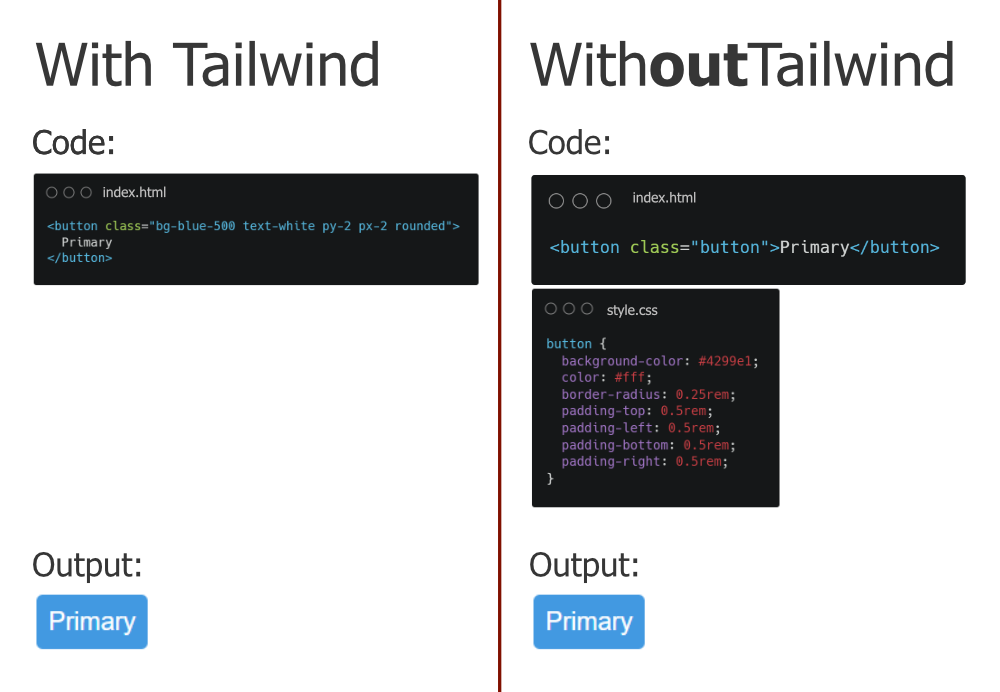

# Modul 4 - React


Selamat datang di React! Di modul ini, kita akan berkenalan dengan _library_ JavaScript paling populer untuk membangun _User Interface_ (UI) yang interaktif dan efisien.

---

## Prasyarat: Cek Instalasi Node.js

Sebelum kita bisa membuat proyek React, kita **wajib** memiliki Node.js. Kenapa? Karena kita membutuhkan **NPM** (Node Package Manager) untuk mengunduh _package_ React dan menjalankan server pengembangan.

Buka terminal Anda dan jalankan dua perintah ini:

```bash
node -v
npm -v
```

Jika sudah terinstal, akan menunjukkan versi dari node dan npm


Jika belum terinstal, silahkan instal node seperti yang ada di **modul 2**

## Apa itu React & Mengapa Pakai?

### 1. Apa itu React?

Secara sederhana, **React** adalah _library_ (pustaka) JavaScript yang dibuat oleh Facebook untuk membangun antarmuka pengguna (UI).

Pikirkan React seperti **kotak mainan LEGO digital**. Daripada membangun seluruh halaman web sebagai satu kesatuan besar, React membiarkan kita membangunnya dari potongan-potongan kecil yang disebut **Komponen**.

Anda bisa membuat komponen `Tombol`, komponen `Navbar`, komponen `FormInput`, lalu menggabungkan semua "LEGO" tersebut untuk membuat aplikasi web yang utuh.

### 2. Mengapa Harus Pakai React?

1.  **Berbasis Komponen**: Membuat kode jadi **reusable** (bisa dipakai ulang), lebih rapi, dan mudah dikelola. Mau 10 tombol di halaman? Cukup panggil komponen `Tombol` 10 kali.
2.  **Deklaratif**: Kita cukup memberi tahu React **apa** yang kita inginkan tampil di layar (misal: "tampilkan nama pengguna"), dan React yang akan mengurus _bagaimana_ cara menampilkannya. Ini lebih sederhana daripada JavaScript biasa (imperatif) di mana kita harus memberi instruksi langkah demi langkah (`document.getElementById(...)`, `innerHTML = ...`).
3.  **Cepat dan Efisien**: Ini adalah alasan terbesarnya. React menggunakan teknologi canggih bernama **Virtual DOM** (akan kita bahas selanjutnya) yang membuat aplikasi terasa sangat cepat dan responsif.

---

## JSX (JavaScript XML) vs. JS

Saat pertama kali melihat React, Anda akan menemukan sintaks yang terlihat seperti HTML di dalam file JavaScript. Ini disebut **JSX**.

- **JavaScript (JS) Murni**
  Jika kita ingin membuat `<h1>` dengan JS murni (menggunakan React), kodenya akan terlihat seperti ini. Cukup merepotkan.

  ```javascript
  const element = React.createElement(
  	"h1",
  	{ className: "judul" },
  	"Halo, Praktikan!"
  );
  ```

- **JSX (JavaScript XML)**
  JSX adalah "gula sintaksis" (_syntactic sugar_) yang mempermudah penulisan. Kode di atas bisa kita tulis seperti ini:
  ```jsx
  const element = <h1 className="judul">Halo, Praktikan!</h1>;
  ```
  Jauh lebih mudah dibaca, bukan?

**Poin Penting:** Browser **tidak mengerti JSX**. Di belakang layar, _compiler_ (seperti Babel atau Vite) akan mengubah kode JSX Anda yang cantik itu kembali menjadi kode `React.createElement()` yang bisa dimengerti oleh JavaScript.

---

## Apa itu Virtual DOM?

Ini adalah salah satu konsep "sihir" di balik kecepatan React.

- **Masalah:** Memanipulasi **DOM Asli** (Real DOM) di browser itu sangat **lambat** dan "mahal" secara sumber daya. Bayangkan Anda harus merenovasi seluruh rumah hanya untuk mengganti satu ubin.

- **Solusi React:** **Virtual DOM (VDOM)**.

Virtual DOM adalah **salinan** atau **cetak biru (blueprint) ringan** dari DOM asli yang disimpan oleh React di dalam memori.

Prosesnya begini:

1.  Saat ada data berubah (misal: Anda mengetik di _form_), React akan membuat **cetak biru baru** di Virtual DOM.
2.  React membandingkan cetak biru baru ini dengan cetak biru lama (proses ini disebut **"diffing"**). Ini super cepat karena terjadi di memori, bukan di browser.
3.  React menemukan, "Oh, ternyata yang berubah cuma teks di paragraf ini."
4.  React kemudian **hanya mengubah satu paragraf itu saja** di DOM Asli. Proses ini disebut **"reconciliation"**.

**Analogi:** Daripada merenovasi seluruh rumah (Real DOM), React membandingkan denah lama dan denah baru (Virtual DOM), lalu hanya menyuruh tukang untuk memindahkan satu kursi yang berbeda (Reconciliation).

---

## Cara Inisiasi Proyek React

Cara tercepat dan paling modern untuk memulai proyek React adalah menggunakan _build tool_ bernama **Vite** (dibaca "vit").

Ikuti langkah-langkah ini di terminal Anda:

1.  **Jalankan Perintah Create Vite**
    Pastikan Anda berada di direktori tempat Anda ingin menyimpan proyek (misal `Documents/`).

    ```bash
    npm create vite@latest
    ```

2.  **Ikuti Petunjuknya**
    Vite akan menanyakan beberapa hal. Jawab seperti ini:

    - **Project name:** `...` (Isi nama proyek Anda, misal: `latihan-react`)
    - **Select a framework:** `...` (Gunakan panah, pilih **React**)
    - **Select a variant:** `...` (Gunakan panah, pilih **TypeScript**)
    - **Install with npm and start now?** `...` (Pilih **Yes**)

3.  **Proses Otomatis & Buka di Browser**
    Setelah Anda memilih "Yes", Vite akan secara otomatis melakukan semua langkah untuk Anda:

    - Membuat folder proyek.
    - Menjalankan `npm install` (mengunduh semua _package_).
    - Menjalankan `npm run dev` (menyalakan server pengembangan).

    Anda tidak perlu lagi mengetik `cd ...` atau `npm install` secara manual.

    Terminal akan langsung memberi Anda URL (biasanya `http://localhost:5173/`). Buka alamat itu di browser, dan Anda akan melihat proyek React pertama Anda berjalan!
    

## Component and Props

**Component** adalah building block utama dalam React. Component memungkinkan kita memecah UI menjadi bagian-bagian independen dan reusable.

**Props** (properties) adalah cara untuk passing data dari parent component ke child component. Props bersifat read-only dan tidak boleh dimodifikasi oleh child component.

### Contoh

1. Basic Functional Component

```jsx
function Welcome() {
	return <h1>Selamat Datang di React!</h1>;
}
```

2. Component dengan Props

```jsx
// Ini adalah komponen yang menerima props
function UserCard(
	props // ini adalah parameter props
) {
	return (
		<div className="card">
			<h2>{props.name}</h2>
			<p>Umur: {props.age}</p>
			<p>Email: {props.email}</p>
		</div>
	);
}

// Ini adalah komponen utama yang menggunakan Component UserCard
function App() {
	return (
		<div>
			{/* name, age, email adalah props */}
			<UserCard name="Budi" age={25} email="budi@email.com" />
			<UserCard name="Ani" age={23} email="ani@email.com" />
		</div>
	);
}
```

3. Destructuring Props

```jsx
// Props dipisah menjadi masing-masing variabel
function ProductCard({ name, price, stock }) {
	return (
		<div className="product">
			<h3>{name}</h3>
			<p>Harga: Rp {price.toLocaleString()}</p>
			<p>Stok: {stock}</p>
		</div>
	);
}
```

4. Props dengan Default Values

```jsx
// Text dan Color diisi dengan default value
function Button({ text = "Click Me", color = "blue" }) {
	return <button style={{ backgroundColor: color }}>{text}</button>;
}
```

5. Props dengan Children

```jsx
function Container({ children }) {
	return <div className="container">{children}</div>;
}

function App() {
	return (
		<Container>
			<h1>Ini adalah judul</h1>
			<p>Ini adalah paragraf di dalam container</p>
		</Container>
	);
}
```

## Event Handling

Aplikasi web perlu merespons interaksi pengguna, seperti klik, ketikan keyboard, atau submit form. Di React, ini disebut **Event Handling**.

1. Event onClick

`onClick` digunakan untuk handling event click oleh user. Umumnya digunakan pada sebuah button.

```jsx
function ButtonClick() {
	function handleClick() {
		alert("Button diklik!");
	}

	return <button onClick={handleClick}>Klik Saya</button>;
}
```

2. Event onChange

`onChange` umumnya digunakan pada element input untuk mendeteksi perubahan isi input oleh user.

```jsx
function FormInput() {
	const [name, setName] = React.useState("");

	function handleChange(event) {
		setName(event.target.value);
	}

	return (
		<div>
			<input
				type="text"
				value={name}
				onChange={handleChange}
				placeholder="Masukkan nama"
			/>
			<p>Nama Anda: {name}</p>
		</div>
	);
}
```

3. Event onSubmit

`onSubmit` digunakan untuk handling event ketika user melakukan submit, umumnya pada sebuah form.

```jsx
function LoginForm() {
	const [username, setUsername] = React.useState("");
	const [password, setPassword] = React.useState("");

	function handleSubmit(event) {
		event.preventDefault();
		console.log("Username:", username);
		console.log("Password:", password);
		alert(`Login dengan username: ${username}`);
	}

	return (
		<form onSubmit={handleSubmit}>
			<div>
				<input
					type="text"
					value={username}
					onChange={(e) => setUsername(e.target.value)}
					placeholder="Username"
				/>
			</div>
			<div>
				<input
					type="password"
					value={password}
					onChange={(e) => setPassword(e.target.value)}
					placeholder="Password"
				/>
			</div>
			<button type="submit">Login</button>
		</form>
	);
}
```

Masih banyak lagi jenis Event Handling yang dapat digunakan. Kalian dapat explore sendiri untuk jenis-jenis Event Handling yang lain sesuai kebutuhan kalian.

## Conditional Rendering

**Conditional Rendering** adalah teknik untuk menampilkan component atau element berdasarkan kondisi tertentu. React menyediakan beberapa cara untuk melakukan conditional rendering.

1. If-Else Statement

```jsx
function Greeting({ isLoggedIn }) {
	if (isLoggedIn) {
		return <h1>Selamat datang kembali!</h1>;
	} else {
		return <h1>Silakan login terlebih dahulu.</h1>;
	}
}
```

2. Ternary Operator

```jsx
function LoginButton({ isLoggedIn }) {
	return (
		<div>{isLoggedIn ? <button>Logout</button> : <button>Login</button>}</div>
	);
}
```

3. Logical && Operator

```jsx
function Notification({ hasNewMessage, messageCount }) {
	return (
		<div>
			<h1>Dashboard</h1>
			{hasNewMessage && <p>Anda memiliki {messageCount} pesan baru!</p>}
		</div>
	);
}
```

4. Conditional Class/style

```jsx
function StatusBadge({ isActive }) {
	return (
		<span
			className={isActive ? "badge-active" : "badge-inactive"}
			style={{
				backgroundColor: isActive ? "green" : "red",
				color: "white",
				padding: "5px 10px",
				borderRadius: "5px",
			}}
		>
			{isActive ? "Aktif" : "Nonaktif"}
		</span>
	);
}
```

5. Complex Conditional Rendering

```jsx
function Dashboard({ user }) {
	if (!user) {
		return <p>Loading...</p>;
	}

	if (user.isBlocked) {
		return <p>Akun Anda telah diblokir.</p>;
	}

	if (!user.isVerified) {
		return (
			<div>
				<p>Email Anda belum diverifikasi.</p>
				<button>Kirim Ulang Email Verifikasi</button>
			</div>
		);
	}

	return (
		<div className="dashboard">
			<h1>Selamat datang, {user.name}!</h1>
			<p>Email: {user.email}</p>
		</div>
	);
}
```

## Render List and Key List

Saat menggunakan React, kita seringkali perlu menampilkan sekumpulan data yang berbentuk _array_. Untuk itu, kita dapat menggunakan metode _array_ dalam Javascript untuk dapat menampilkan data tersebut, yaitu `map()`.

`map()` merupakan salah satu _array_ method dalam Javascript yang berfungsi untuk mengiterasi setiap elemen dalam _array_ sekaligus memanipulasinya. Fungsi ini akan membuat _array_ baru dengan cara **"mengunjungi"** setiap item di _array_ asli satu per satu, lalu mengubahnya (transformasi) sesuai instruksi yang kita berikan. Berikut adalah contoh implementasinya:

```tsx
const datas = [
	{
		id: "dbbad590-41f7-4dd6-9d6a-025aa5cd8145",
		username: "Joanie.Franecki",
		email: "Raphael_Zulauf40@yahoo.com",
	},
	{
		id: "8d578b9f-c1c6-45a6-bbf8-1c49ecf43136",
		username: "Kale.Lubowitz93",
		email: "Rhoda5@gmail.com",
	},
];

export default function App() {
	return (
		<>
			{datas.map((data) => (
				<div key={data.id}>
					<p>{data.username}</p>
					<p>{data.email}</p>
				</div>
			))}
		</>
	);
}
```

Contoh implementasi yang lain:

```tsx
const datas = [
	{
		id: "80884465-b0f9-4d64-ab2d-e9a8ac0bd78f",
		username: "Laurence_Kohler",
		email: "June.Johnston29@gmail.com",
	},
	{
		id: "8a8656d5-d09d-4ef7-9c1f-0d42180b6970",
		username: "Frederic_Krajcik36",
		email: "Kristopher4@gmail.com",
	},
];

export default function App() {
	return (
		<>
			{datas.map((data) => {
				const isAvailable = data.email === "Kristopher4@gmail.com";

				return (
					<div key={data.id}>
						<p>{data.username}</p>
						<p>{data.email}</p>
						<p>Available: {isAvailable}</p>
					</div>
				);
			})}
		</>
	);
}
```

Dalam kode di atas, `datas.map()` akan melakukan iterasi (perulangan) pada setiap objek di dalam _array_ `datas`. Untuk setiap objek `data`, fungsi ini akan **mengembalikan (return) elemen** `<div>` baru yang berisi `<p>` untuk `username` dan `email`.

#### Apa fungsi `key` dalam elemen `div`?

`key` berfungsi sebagai _identifier_ atau tanda pengenal untuk setiap elemen `<div>`. Dalam kode diatas, nilai `key` yang digunakan (`data.id`) harus bernilai unik untuk setiap item yang ada dalam array, agar React dapat dengan mudah mengidentifikasinya.

## Hooks

### `useState()`

> _State_ merupakan data internal pada sebuah komponen yang dapat berubah seiring dengan interaksi yang dilakukan oleh pengguna.

`useState()` merupakan _hooks_ bawaan React yang berfungsi untuk membuat dan mengelola state dalam sebuah komponen. Fungsi ini secara _default_ mengembalikan dua elemen dalam array, yaitu `state` dan `setState`.

- `state` merupakan nilai data saat ini
- `setState` merupakan fungsi untuk mengubah/memperbarui nilai `state`

Berikut adalah sintaks dasar dari penggunaan `useState()`:

```tsx
const [state, setState] = useState(initialValue);
```

Berikut adalah contoh dari penggunaan `useState()`:

```tsx
import { useState } from "react";

export default function App() {
	const [count, setCount] = useState(0);

	return (
		<div>
			<p>You clicked {count} times</p>
			<button onClick={() => setCount(count + 1)}>Click me</button>
		</div>
	);
}
```

Dalam kode tersebut, _state_ `count` diinisiasi dengan nilai `0`, dan saat _user_ menekan tombol, nilai dari `count` akan bertambah 1.

> Setelah nilai state berubah dan halaman di-_reload_, nilai `state` akan kembali ke nilai awalnya.

### `useEffect()`

`useEffect()` digunakan untuk menjalankan _side effect_. _Hooks_ ini akan berjalan ketika:

- Komponen pertama kali di-_render_ (_mount_)
- Komponen diperbarui (_update_)
- Komponen dihapus (_unmount_)

Beberapa contoh _case_ yang dapat dikelola dengan `useEffect()` antara lain:

- Mengambil data dari API
- Mengatur timer atau interval
- Memperbarui elemen di halaman

Berikut adalah sintaks dasar dari penggunaan `useEffect()`:

```tsx
useEffect(() => {
	// kode yang dijalankan
}, [dependencies]);
```

- Fungsi pertama (_callback_) berisi kode yang akan dijalankan
- Array `dependencies` berisi `state` atau `variabel` yang digunakan untuk menentukan kapan `useEffect()` dijalankan

Berikut adalah contoh implementasi `useEffect()`

#### Tanpa Dependencies

```tsx
import { useState, useEffect } from "react";

export default function App() {
	const [count, setCount] = useState(0);

	useEffect(() => {
		console.log("Component rerender!");
	});

	return (
		<div>
			<p>You clicked {count} times</p>
			<button onClick={() => setCount(count + 1)}>Click Me</button>
		</div>
	);
}
```

Dalam kode tersebut, `useEffect()` akan berjalan setiap kali komponen di-_render_ ulang. Akan tetapi, setiap kali menekan tombol, `useEffect()` tidak akan dijalankan ulang.

#### Dependencies Array Kosong

Penggunaan array kosong sebagai _dependencies_ di `useEffect()` akan membuat `useEffect()` hanya dijalankan sekali, tepatnya pada saat komponen pertama kali muncul (_mount_). Contoh _case_ penggunaannya adalah untuk mengambil data dari API sekali saja saat aplikasi dijalankan.

```tsx
import { useEffect } from "react";

export default function App() {
	useEffect(() => {
		console.log("Component rendered!");
	}, []);

	return <h1>Hello, React!</h1>;
}
```

#### Dengan Dependencies

```tsx
import { useState, useEffect } from "react";

export default function App() {
	const [count, setCount] = useState(0);

	useEffect(() => {
		console.log(`Count set to: ${count}`);
	}, [count]);

	return (
		<div>
			<p>You clicked {count} times</p>
			<button onClick={() => setCount(count + 1)}>Click Me</button>
		</div>
	);
}
```

Dalam kode tersebut, `useEffect()` akan berjalan setiap kali komponen di-_render_ ulang dan setiap kali menekan tombol.

## Fetch API

Fetch API adalah fitur bawaan JavaScript untuk mengambil (fetch) data dari sumber eksternal, seperti REST API.

Biasanya digunakan untuk:

- Mengambil data dari server (GET)
- Mengirim data ke server (POST, PUT, DELETE)
- Menangani hasil (response) dan error

Di React, fetch API sering digunakan di dalam hook useEffect untuk mengambil data saat komponen pertama kali dirender.

```jsx
import { useEffect, useState } from "react";
import { Link } from "react-router-dom";

export default function CommentList() {
  const [comments, setComments] = useState<Comment[]>([]);
  const [loading, setLoading] = useState(true);

  useEffect(() => {
    const fetchComments = async () => {
      try {
        const res = await fetch("https://dummyjson.com/comments");
        if (!res.ok) {
          throw new Error("Network response was not ok");
        }
        const data = await res.json();
        setComments(data.comments);
      } catch (error) {
        console.error("Gagal ambil data:", error);
      } finally {
        setLoading(false);
      }
    };

    fetchComments();
  }, []);

  if (loading)
    return (
      <div className="flex justify-center items-center h-screen">
        <p className="text-gray-600">Loading comments...</p>
      </div>
    );

  return (
    <div className="max-w-3xl mx-auto space-y-5">
      <h1 className="text-2xl font-bold mb-6 text-center">
        🗨️ Daftar Komentar
      </h1>
      {comments.map((c) => (
        <div key={c.id}>
          <div>
            <h2>{c.user.fullName}</h2>
            <span>@{c.user.username}</span>
          </div>
          <p>{c.body}</p>
          <p>❤️ {c.likes} likes</p>
        </div>
      ))}
    </div>
  );
}
```

Saat mengambil data dari API, kita harus siap menghadapi kemungkinan error, misalnya koneksi gagal, server down, atau URL salah.
Untuk menangani error, kita bisa menggunakan blok try-catch-finally:

```jsx
try {
	// proses utama
} catch (error) {
	// tangani error
} finally {
	// selalu dijalankan
}
```

Penjelasan:

- try berisi proses utama yang berpotensi error
- catch menangani error yang terjadi agar aplikasi tidak crash
- finally dijalankan selalu, misalnya untuk menonaktifkan loading spinner selesai.
  Contoh penggunaannya sudah diterapkan di kode fetchComments() di atas. Dengan cara ini, user tetap mendapat feedback (misalnya “Loading...” atau pesan error), bukan halaman blank.

Axios adalah library pihak ketiga untuk melakukan HTTP request. Keunggulannya dibanding fetch():

- Otomatis mengubah response menjadi JSON.
- Error handling lebih mudah.
- Memiliki interceptor (misalnya menambahkan token ke setiap request)
- Mendukung global configuration

```jsx
useEffect(() => {
	const fetchComments = async () => {
		try {
			const res = await axios.get("https://dummyjson.com/comments");
			setComments(res.data.comments);
		} catch (err) {
			console.error(err);
			setError("Gagal memuat data komentar");
		} finally {
			setLoading(false);
		}
	};

	fetchComments();
}, []);
```
Untuk menginstall axios bisa dengan menjalankan
```
npm install axios
```
Lalu import axios pada file yang dipakai
```
import axios from "axios";
```

## Route (React Router)

React Router digunakan untuk membuat navigasi antar halaman tanpa reload.
Dengan ini, kita bisa membuat :

- Halaman daftar komentar
- Halaman detail komentar berdasarkan ID
- Navigasi antar halaman dengan link

Implementasi dasar React Router:

1.  Pasang React Router: `npm install react-router-dom`
2.  Bungkus aplikasi dengan <BrowserRouter> di main.tsx

    ```jsx
    import { StrictMode } from 'react'
    import { createRoot } from 'react-dom/client'
    import { BrowserRouter } from 'react-router-dom'
    import './index.css'
    import App from './App.tsx'

    createRoot(document.getElementById('root')!).render(
      <StrictMode>
        <BrowserRouter>
        <App />
        </BrowserRouter>
      </StrictMode>
    )
    ```

3.  Definisikan rute di App.tsx menggunakan <Routes> dan <Route>

    ```jsx
    import { Routes, Route } from "react-router-dom";
    import CommentList from "./components/CommentList";
    import CommentDetail from "./components/CommentDetail";

    export default function App() {
    	return (
    		<div className="bg-gray-100 min-h-screen p-6">
    			<Routes>
    				<Route path="/" element={<CommentList />} />
    				<Route path="/comments/:id" element={<CommentDetail />} />
    			</Routes>
    		</div>
    	);
    }
    ```

4.  Gunakan useParams() untuk mengambil parameter rute di komponen detail dan ambil data spesifik berdasarkan ID.

    ````jsx
    import { useEffect, useState } from "react";
    import { useParams, Link } from "react-router-dom";

        export default function CommentDetail() {
          const { id } = useParams<{ id: string }>();
          const [comment, setComment] = useState<Comment | null>(null);
          const [loading, setLoading] = useState(true);

          useEffect(() => {
            const fetchComment = async () => {
              try {
                const res = await fetch(`https://dummyjson.com/comments/${id}`);
                const data = await res.json();
                setComment(data);
              } catch (error) {
                console.error("Gagal ambil detail:", error);
              } finally {
                setLoading(false);
              }
            };

            fetchComment();
          }, [id]);

          if (loading)
            return (
              <div className="flex justify-center items-center h-screen">
                <p className="text-gray-600">Loading detail...</p>
              </div>
            );

          if (!comment)
            return (
              <div className="flex justify-center items-center h-screen">
                <p className="text-red-500">Komentar tidak ditemukan.</p>
              </div>
            );

          return (
            <div>
              <Link to="/">
                ← Kembali
              </Link>
              <h2>{comment.user.fullName}</h2>
              <p>@{comment.user.username}</p>
              <p>{comment.body}</p>
              <div>❤️ {comment.likes} likes | Post ID: {comment.postId}</div>
            </div>
          );
        }
        ```

    Dengan React Router, kita bisa membuat aplikasi SPA (Single Page Application) yang responsif dan user-friendly.
    ````

# Tailwind CSS

## Introduction

Tailwind CSS adalah sebuah framework CSS untuk mempermudah styling dan layouting website. Dengan Tailwind, styling dapat dilakukan dengan class-class atau kode tertentu untuk mengatur tampilan website mulai dari warna, ukuran, margin, padding, dan lainnya tanpa perlu melakukan defining CSS _from scratch_. Sehingga, untuk melakukan styling hanya perlu menambahkan kelas-kelas pada HTML sesuai kebutuhan.



## Instalasi Tailwind CSS pada React

Setelah melakukan init project React, perlu dilakukan langkah-langkah berikut untuk integrasi Tailwind CSS pada project React yang telah di-init.

1. Melakukan instalasi tailwindcss dan dependecies-nya.

```bash
npm install tailwindcss @tailwindcss/vite
```

2. Tambahkan konfigurasi `@tailwindcss/vite` pada file konfigurasi Vite `vite.config.js`.

```javascript
import { defineConfig } from "vite";
import tailwindcss from "@tailwindcss/vite";

export default defineConfig({
	plugins: [tailwindcss()],
});
```

4. Tambahkan `@tailwind` directives pada file CSS pada project React.

```css
@import "tailwindcss";
```

5. Start project React

## Contoh penggunaan Tailwind CSS pada React

```jsx
import React from "react";

export default function HelloWorld() {
	return (
		<main>
			<p className="text-white text-5xl font-bold text-center py-96">
				Hello World
			</p>
		</main>
	);
}
```

# 

---

Untuk dokumentasi yang lebih jelas dapat melihat source resmi dari Tailwind CSS berikut.

**[TailwindCSS installation](https://tailwindcss.com/docs/installation/using-vite)**

## Dokumentasi Tailwind CSS

Untuk dokumentasi yang lebih jelas dapat melihat source resmi dari Tailwind CSS berikut.

**[TailwindCSS installation](https://tailwindcss.com/docs/installation/using-vite)**
