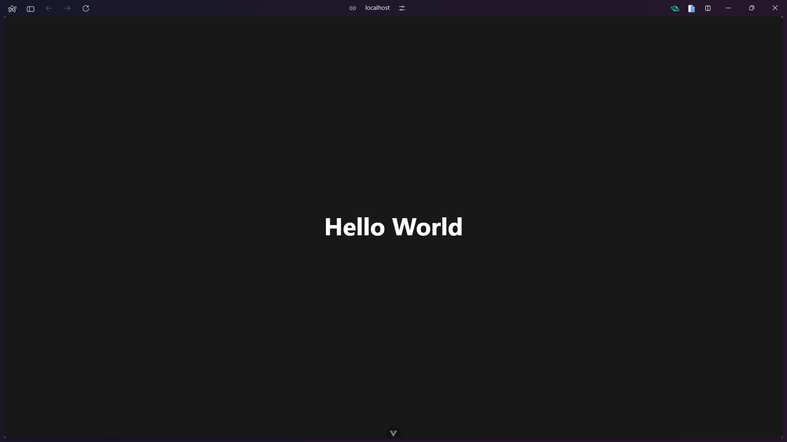

# Modul 4 - React JS

# React JS

## Javascript XML (JSX) and JS Difference

lorem

## Virtual DOM

lorem

## How to init React Project

lorem

## Component and Props

**Component** adalah building block utama dalam React. Component memungkinkan kita memecah UI menjadi bagian-bagian independen dan reusable.

**Props** (properties) adalah cara untuk passing data dari parent component ke child component. Props bersifat read-only dan tidak boleh dimodifikasi oleh child component.

### Contoh

1. Basic Functional Component

```jsx
function Welcome() {
	return <h1>Selamat Datang di React!</h1>;
}
```

2. Component dengan Props

```jsx
// Ini adalah komponen yang menerima props
function UserCard(
	props // ini adalah parameter props
) {
	return (
		<div className="card">
			<h2>{props.name}</h2>
			<p>Umur: {props.age}</p>
			<p>Email: {props.email}</p>
		</div>
	);
}

// Ini adalah komponen utama yang menggunakan Component UserCard
function App() {
	return (
		<div>
			{/* name, age, email adalah props */}
			<UserCard name="Budi" age={25} email="budi@email.com" />
			<UserCard name="Ani" age={23} email="ani@email.com" />
		</div>
	);
}
```

3. Destructuring Props

```jsx
// Props dipisah menjadi masing-masing variabel
function ProductCard({ name, price, stock }) {
	return (
		<div className="product">
			<h3>{name}</h3>
			<p>Harga: Rp {price.toLocaleString()}</p>
			<p>Stok: {stock}</p>
		</div>
	);
}
```

4. Props dengan Default Values

```jsx
// Text dan Color diisi dengan default value
function Button({ text = "Click Me", color = "blue" }) {
	return <button style={{ backgroundColor: color }}>{text}</button>;
}
```

5. Props dengan Children

```jsx
function Container({ children }) {
	return <div className="container">{children}</div>;
}

function App() {
	return (
		<Container>
			<h1>Ini adalah judul</h1>
			<p>Ini adalah paragraf di dalam container</p>
		</Container>
	);
}
```

## Event Handling

Aplikasi web perlu merespons interaksi pengguna, seperti klik, ketikan keyboard, atau submit form. Di React, ini disebut **Event Handling**.

1. Event onClick

`onClick` digunakan untuk handling event click oleh user. Umumnya digunakan pada sebuah button.

```jsx
function ButtonClick() {
	function handleClick() {
		alert("Button diklik!");
	}

	return <button onClick={handleClick}>Klik Saya</button>;
}
```

2. Event onChange

`onChange` umumnya digunakan pada element input untuk mendeteksi perubahan isi input oleh user.

```jsx
function FormInput() {
	const [name, setName] = React.useState("");

	function handleChange(event) {
		setName(event.target.value);
	}

	return (
		<div>
			<input
				type="text"
				value={name}
				onChange={handleChange}
				placeholder="Masukkan nama"
			/>
			<p>Nama Anda: {name}</p>
		</div>
	);
}
```

3. Event onSubmit

`onSubmit` digunakan untuk handling event ketika user melakukan submit, umumnya pada sebuah form.

```jsx
function LoginForm() {
	const [username, setUsername] = React.useState("");
	const [password, setPassword] = React.useState("");

	function handleSubmit(event) {
		event.preventDefault();
		console.log("Username:", username);
		console.log("Password:", password);
		alert(`Login dengan username: ${username}`);
	}

	return (
		<form onSubmit={handleSubmit}>
			<div>
				<input
					type="text"
					value={username}
					onChange={(e) => setUsername(e.target.value)}
					placeholder="Username"
				/>
			</div>
			<div>
				<input
					type="password"
					value={password}
					onChange={(e) => setPassword(e.target.value)}
					placeholder="Password"
				/>
			</div>
			<button type="submit">Login</button>
		</form>
	);
}
```

Masih banyak lagi jenis Event Handling yang dapat digunakan. Kalian dapat explore sendiri untuk jenis-jenis Event Handling yang lain sesuai kebutuhan kalian.

## Conditional Rendering

**Conditional Rendering** adalah teknik untuk menampilkan component atau element berdasarkan kondisi tertentu. React menyediakan beberapa cara untuk melakukan conditional rendering.

1. If-Else Statement

```jsx
function Greeting({ isLoggedIn }) {
	if (isLoggedIn) {
		return <h1>Selamat datang kembali!</h1>;
	} else {
		return <h1>Silakan login terlebih dahulu.</h1>;
	}
}
```

2. Ternary Operator

```jsx
function LoginButton({ isLoggedIn }) {
	return (
		<div>{isLoggedIn ? <button>Logout</button> : <button>Login</button>}</div>
	);
}
```

3. Logical && Operator

```jsx
function Notification({ hasNewMessage, messageCount }) {
	return (
		<div>
			<h1>Dashboard</h1>
			{hasNewMessage && <p>Anda memiliki {messageCount} pesan baru!</p>}
		</div>
	);
}
```

4. Conditional Class/style

```jsx
function StatusBadge({ isActive }) {
	return (
		<span
			className={isActive ? "badge-active" : "badge-inactive"}
			style={{
				backgroundColor: isActive ? "green" : "red",
				color: "white",
				padding: "5px 10px",
				borderRadius: "5px",
			}}
		>
			{isActive ? "Aktif" : "Nonaktif"}
		</span>
	);
}
```

5. Complex Conditional Rendering

```jsx
function Dashboard({ user }) {
	if (!user) {
		return <p>Loading...</p>;
	}

	if (user.isBlocked) {
		return <p>Akun Anda telah diblokir.</p>;
	}

	if (!user.isVerified) {
		return (
			<div>
				<p>Email Anda belum diverifikasi.</p>
				<button>Kirim Ulang Email Verifikasi</button>
			</div>
		);
	}

	return (
		<div className="dashboard">
			<h1>Selamat datang, {user.name}!</h1>
			<p>Email: {user.email}</p>
		</div>
	);
}
```

## Render List and Key List

lorem

## Hooks

lorem

## Fetch API

lorem

## Route (React Router)

lorem

# Tailwind CSS

## Introduction

Tailwind CSS adalah sebuah framework CSS untuk mempermudah styling dan layouting website. Dengan Tailwind, styling dapat dilakukan dengan class-class atau kode tertentu untuk mengatur tampilan website mulai dari warna, ukuran, margin, padding, dan lainnya tanpa perlu melakukan defining CSS _from scratch_. Sehingga, untuk melakukan styling hanya perlu menambahkan kelas-kelas pada HTML sesuai kebutuhan.


## Instalasi Tailwind CSS pada React

Setelah melakukan init project React, perlu dilakukan langkah-langkah berikut untuk integrasi Tailwind CSS pada project React yang telah di-init.

1. Melakukan instalasi tailwindcss dan dependecies-nya.

```bash
npm install tailwindcss @tailwindcss/vite
```

2. Tambahkan konfigurasi `@tailwindcss/vite` pada file konfigurasi Vite `vite.config.js`.

```javascript
import { defineConfig } from "vite";
import tailwindcss from "@tailwindcss/vite";

export default defineConfig({
	plugins: [tailwindcss()],
});
```

4. Tambahkan `@tailwind` directives pada file CSS pada project React.

```css
@import "tailwindcss";
```

5. Start project React

<<<<<<< HEAD

## Contoh penggunaan Tailwind CSS pada React

```jsx
import React from "react";

export default function HelloWorld() {
	return (
		<main>
			<p className="text-white text-5xl font-bold text-center py-96">
				Hello World
			</p>
		</main>
	);
}
```

# 

### 2.2 Mengapa Harus Pakai React?

1.  **Berbasis Komponen**: Membuat kode jadi **reusable** (bisa dipakai ulang), lebih rapi, dan mudah dikelola. Mau 10 tombol di halaman? Cukup panggil komponen `Tombol` 10 kali.
2.  **Deklaratif**: Kita cukup memberi tahu React **apa** yang kita inginkan tampil di layar (misal: "tampilkan nama pengguna"), dan React yang akan mengurus _bagaimana_ cara menampilkannya. Ini lebih sederhana daripada JavaScript biasa (imperatif) di mana kita harus memberi instruksi langkah demi langkah (`document.getElementById(...)`, `innerHTML = ...`).
3.  **Cepat dan Efisien**: Ini adalah alasan terbesarnya. React menggunakan teknologi canggih bernama **Virtual DOM** (akan kita bahas selanjutnya) yang membuat aplikasi terasa sangat cepat dan responsif.

---

> > > > > > > e38c7429ea1c1c91bde47b8af5ad41b8713ac845

## 3. JSX (JavaScript XML) vs. JS

<<<<<<< HEAD
Untuk dokumentasi yang lebih jelas dapat melihat source resmi dari Tailwind CSS berikut.

**[TailwindCSS installation](https://tailwindcss.com/docs/installation/using-vite)**

## Dokumentasi Tailwind CSS

Untuk dokumentasi yang lebih jelas dapat melihat source resmi dari Tailwind CSS berikut.

**[TailwindCSS installation](https://tailwindcss.com/docs/installation/using-vite)**

# Untuk mempelajari dan menggunakan Tailwind CSS, bisa menuju ke link documentation resmi dari Tailwind CSS berikut karena documentation yang diberikan sudah sangat lengkap dan mencakup hampir keseluruhan penggunaan Tailwind CSS.

Saat pertama kali melihat React, Anda akan menemukan sintaks yang terlihat seperti HTML di dalam file JavaScript. Ini disebut **JSX**.

> > > > > > > e38c7429ea1c1c91bde47b8af5ad41b8713ac845

- **JavaScript (JS) Murni**
  Jika kita ingin membuat `<h1>` dengan JS murni (menggunakan React), kodenya akan terlihat seperti ini. Cukup merepotkan.

  ```javascript
  const element = React.createElement(
  	"h1",
  	{ className: "judul" },
  	"Halo, Praktikan!"
  );
  ```

- **JSX (JavaScript XML)**
  JSX adalah "gula sintaksis" (_syntactic sugar_) yang mempermudah penulisan. Kode di atas bisa kita tulis seperti ini:
  ```jsx
  const element = <h1 className="judul">Halo, Praktikan!</h1>;
  ```
  Jauh lebih mudah dibaca, bukan?

**Poin Penting:** Browser **tidak mengerti JSX**. Di belakang layar, _compiler_ (seperti Babel atau Vite) akan mengubah kode JSX Anda yang cantik itu kembali menjadi kode `React.createElement()` yang bisa dimengerti oleh JavaScript.

---

## 4. Apa itu Virtual DOM?

Ini adalah salah satu konsep "sihir" di balik kecepatan React.

- **Masalah:** Memanipulasi **DOM Asli** (Real DOM) di browser itu sangat **lambat** dan "mahal" secara sumber daya. Bayangkan Anda harus merenovasi seluruh rumah hanya untuk mengganti satu ubin.

- **Solusi React:** **Virtual DOM (VDOM)**.

Virtual DOM adalah **salinan** atau **cetak biru (blueprint) ringan** dari DOM asli yang disimpan oleh React di dalam memori.

Prosesnya begini:

1.  Saat ada data berubah (misal: Anda mengetik di _form_), React akan membuat **cetak biru baru** di Virtual DOM.
2.  React membandingkan cetak biru baru ini dengan cetak biru lama (proses ini disebut **"diffing"**). Ini super cepat karena terjadi di memori, bukan di browser.
3.  React menemukan, "Oh, ternyata yang berubah cuma teks di paragraf ini."
4.  React kemudian **hanya mengubah satu paragraf itu saja** di DOM Asli. Proses ini disebut **"reconciliation"**.

**Analogi:** Daripada merenovasi seluruh rumah (Real DOM), React membandingkan denah lama dan denah baru (Virtual DOM), lalu hanya menyuruh tukang untuk memindahkan satu kursi yang berbeda (Reconciliation).

---

## 5. Cara Inisiasi Proyek React 🚀

Cara tercepat dan paling modern untuk memulai proyek React adalah menggunakan _build tool_ bernama **Vite** (dibaca "vit").

Ikuti langkah-langkah ini di terminal Anda:

1.  **Jalankan Perintah Create Vite**
    Pastikan Anda berada di direktori tempat Anda ingin menyimpan proyek (misal `Documents/`).

    ```bash
    npm create vite@latest
    ```

2.  **Ikuti Petunjuknya**
    Vite akan menanyakan beberapa hal. Jawab seperti ini:

    - **Project name:** `...` (Isi nama proyek Anda, misal: `latihan-react`)
    - **Select a framework:** `...` (Gunakan panah, pilih **React**)
    - **Select a variant:** `...` (Gunakan panah, pilih **TypeScript**)
    - **Install with npm and start now?** `...` (Pilih **Yes**)

3.  **Proses Otomatis & Buka di Browser**
    Setelah Anda memilih "Yes", Vite akan secara otomatis melakukan semua langkah untuk Anda:

    - Membuat folder proyek.
    - Menjalankan `npm install` (mengunduh semua _package_).
    - Menjalankan `npm run dev` (menyalakan server pengembangan).

    Anda tidak perlu lagi mengetik `cd ...` atau `npm install` secara manual.

    Terminal akan langsung memberi Anda URL (biasanya `http://localhost:5173/`). Buka alamat itu di browser, dan Anda akan melihat proyek React pertama Anda berjalan!
    
